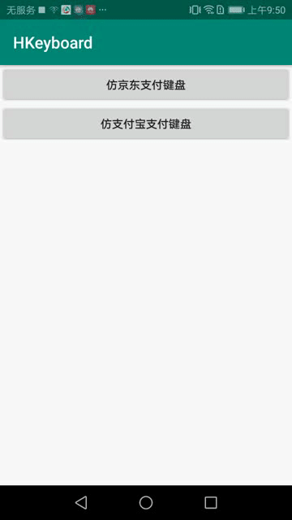

# 自定义键盘(仿京东和支付宝键盘)
## 效果图    
|仿京东支付键盘 |仿支付宝支付键盘  
|---|---|
||    
## 使用方式   
+ 京东支付键盘   
```
    override fun onCreate(savedInstanceState: Bundle?) {
            ···
            boardHelper = HKeyBoardHelper(this)
                .bindEditText(editText)
                .updateKeyBoardStyle(R.xml.number_keyboard)
     }

```  
+ 支付宝支付键盘  
```
    override fun onCreate(savedInstanceState: Bundle?) {
            ···
            boardHelper = HKeyBoardHelper(this)
                .bindEditText(editText)
                .updateKeyBoardStyle(R.xml.abc_keyboard)
                .setOnKeyClickListener(onKeyClickListener)  
     }
    /**
     * 设置特殊按键监听
     */
    private val onKeyClickListener: (code: Int, keyData: HKeyData) -> Boolean = { code, keyData ->
           when (code) {
               HKeyBoardView.ALI_CODE_DONE -> {
                   Toast.makeText(this, "完成按钮", Toast.LENGTH_SHORT).show()
                   true
               }
               HKeyBoardView.ALI_CODE_ABC_KEYBOARD_NUMBER -> {//切换键盘为 字符1类型
                   boardHelper.updateKeyBoardStyle(R.xml.abc_keyboard_symbol1)
                   true
               }
               HKeyBoardView.ALI_CODE_SYMBOL1_KEYBOARD_ABC -> {  //切换键盘为 字母键盘
                   boardHelper.updateKeyBoardStyle(R.xml.abc_keyboard)
                   true
               }
               HKeyBoardView.ALI_CODE_SYMBOL1_KEYBOARD_NUMBER -> {//  切换键盘为 字符2类型
                   boardHelper.updateKeyBoardStyle(R.xml.abc_keyboard_symbol2)
                   true
               }
               HKeyBoardView.ALI_CODE_SYMBOL2_KEYBOARD_SYMBOL -> {//切换键盘为 字符1类型
                   boardHelper.updateKeyBoardStyle(R.xml.abc_keyboard_symbol1)
                   true
               }
               else -> false
           }
       }
```   
**setOnKeyClickListener(listener: (code: Int, keyData: HKeyData) -> Boolean)方法，拦截键的点击事件，如果返回true，则会消耗事件，不会执行默认的行为**
## 自定义键盘   
修改键盘样式类型，需重写键盘的xml文件，可以将number_keyboard.xml或abc_keyboard.xml复制到自己项目中的src/main/res/xml目录下重命名后进行修改。
HKeyBoardHelper.updateKeyBoardStyle(R.xml.xxx) 替换为自己项目中的xml文件即可  
xml文件一共有三层如下  
```
<HKeyboard>
    <Row>
        <Key/>
    </Row>
<HKeyboard>
```    
HKeyboard表示键盘的属性，Row表示每行键的属性，Key表示每个键的属性。  
HKeyboard和Key相同的属性，以Key的属性为准   
  
HKeyboard所有属性如下  

|属性名 |值类型 | 含义  
|---|---|----  
|ratioWH| Float| 键盘宽高比
|paddingLeft|dimen资源|左侧Padding
|paddingTop|dimen资源|上侧Padding
|paddingRight|dimen资源|右侧Padding
|paddingBottom|dimen资源|下侧Padding
|horizontalSpacing|dimen资源|每列键的间距
|verticalSpacing|dimen资源|每行键的间距
|backgroundColor|color资源|键盘的背景颜色
|keyBackgroundColor|color资源|每个键的背景颜色
|keyTextColor|color资源|每个键文字的颜色
|keyTextSize|dimen资源|每个键文字的尺寸大小
|keyBorderRadius|dimen资源|每个键圆角尺寸大小

Row所有属性如下  

|属性名 |值类型 | 含义  
|---|---|----  
|leftSpaceWeight| Float| 该行键左侧间距的权重
|rightSpaceWeight| Float| 该行键右侧间距的权重 

Key所有属性如下  

|属性名 |值类型 | 含义  
|---|---|----  
|code| Int| 键的唯一标示
|value| String| 该键对应的文字
|drawableRes| drawable资源| 该键的图片资源(只有value是空时，才会显示图片)
|weight| Float| 该键宽度的权重
|keyBackgroundColor|color资源|该键的背景颜色
|keyTextColor|color资源|该键文字的颜色
|keyTextSize|dimen资源|该键文字的尺寸大小
|keyBorderRadius|dimen资源|该键圆角尺寸大小  
**自定义键盘注意点**  
1. code不能重复，下面这三个code值不能随意改变
~~~
const val CODE_DELETE = -5 //删除键
const val CODE_BLACK = 38 //空格键
const val CODE_SHIFT = -1 //shift上档键 切换大小写
~~~
2. 键的背景颜色、键的文字颜色、键的展示图片如果需要点击效果可以使用selector资源文件，格式如下   
```
<selector xmlns:android="http://schemas.android.com/apk/res/android">
    <item android:color="按下效果" android:state_pressed="true"/>
    <item android:color="正常效果"/>
</selector>
```
3. 只有shift有选中状态，shift键的 图片/背景/文字颜色可以通过selector资源文件的 android:state_selected="true" 来设置选中效果   
```
<selector xmlns:android="http://schemas.android.com/apk/res/android">
    <item android:state_selected="true" android:drawable="选中图片"/>
    <item android:drawable="正常图片"/>
</selector>
```
## 不足  
+ 自定义的xml文件，引用资源时不会自动联想，重命名资源文件时，xml文件中的资源需要手打修改。


